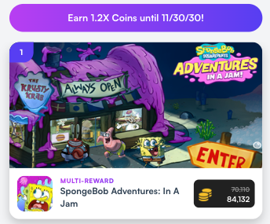
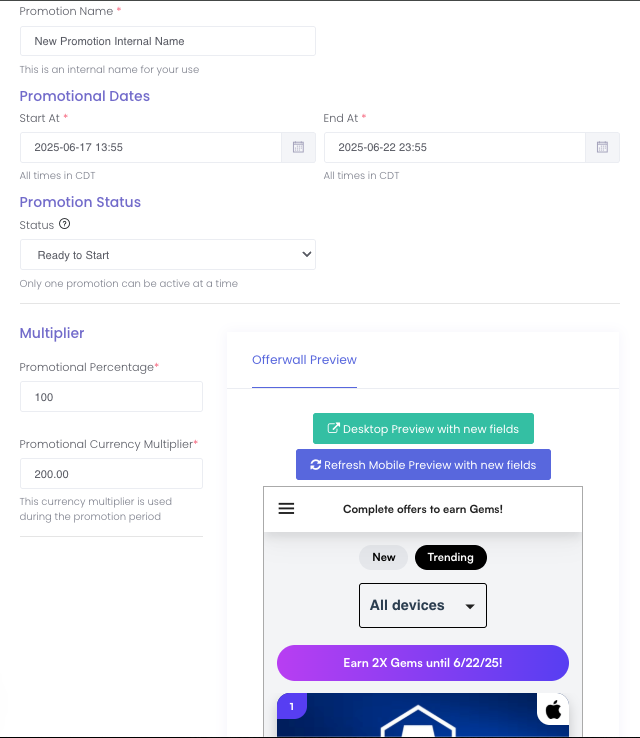

# Offer Wall Promotions: Drive More Engagement & Revenue

**Offer Wall Promotions** — also known as **"Currency Sales"** — are a powerful way to boost traffic, increase conversions, and maximize revenue from your offerwall.

Here's how it works: You can **temporarily increase your virtual currency multiplier** — the amount of currency users earn per $1 in offerwall revenue. For example:

> If your regular multiplier is `100`, you can schedule a promotion to increase it to `200` for a **Double Rewards Weekend**.

### Enhanced Offer Wall UI

While a promotion is live, we've enhanced the Offer Wall UI to make it stand out:

- A promotion banner will be shown at the top of the offerwall to inform users of reward bonus and the duration of the event
- Regular reward amounts are **crossed out**
- New, higher rewards are **boldly highlighted**, making the bonus clear and enticing to users

---

## Offer Wall Promotion Setup

Follow the steps below to setup an Offer Wall Promotion.

### Step 1 — Create

Create a new Offer Wall Promotion by going to your app property's settings page and look for the "Promotions" tab towards the top of the page. After clicking the "Promotions" tab, click on the "New Promotion" button.

### Step 2 — Customize & Schedule

1. **Open the New Promotion Dialog** - Enter the details for your Offer Wall Promotion.

2. **Set the Schedule**
   - Click the **"Start At"** and **"End At"** fields to choose when the promotion should begin and end.
   - *Note: All times are in CDT.*

3. **Adjust the Promotional Multiplier**
   - Use the **"Promotional Percentage"** field to set your currency boost.
   - *Example: For a 2x promotion, enter* `100` *(which equals a 100% bonus).*

4. **Create Your Promotion**
   - Click **"Create Promotion"**.
   - Your promotion will automatically activate and deactivate based on the times you selected.

5. **Preview the Promotion**
   - Click the **preview buttons** to see how your promotion will appear on both desktop and mobile.

### Step 3 — Notify Users of the Promotion

Maximize the impact of your promotion by letting users know it's live and for a limited time only. Boost engagement and spike offer wall traffic with eye-catching push notifications, timely emails, and in-app pop-up alerts. The more visibility, the more completions — don't let your bonus rewards go unnoticed!
