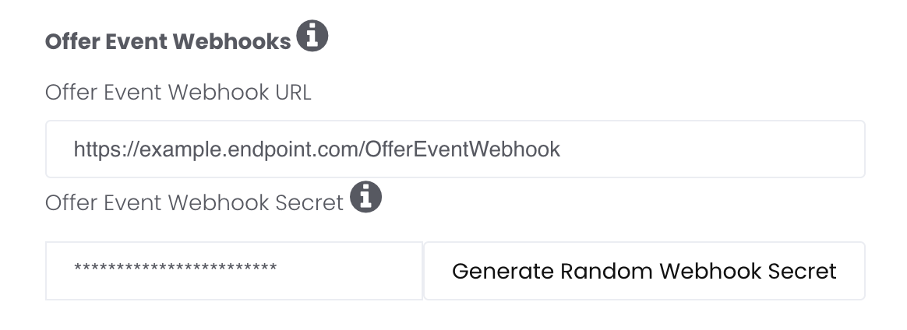
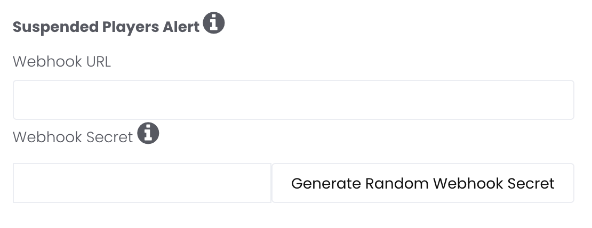

import Tabs from '@theme/Tabs';
import TabItem from '@theme/TabItem';

# Webhooks

Webhooks provide real-time, server-to-server notifications about offer-level changes and player suspension events. Unlike [postbacks](/docs/integrate/reward-mechanism/postbacks-v3) — which notify you when players complete offers or install apps — webhooks keep you informed about changes in offer availability and player eligibility between API calls.

There are two webhook types:

- **[Offer Event Webhooks](#offer-event-webhooks)** — Real-time notifications when offers are created, updated, or removed (exclusive to API integrations).
- **[Suspended Player Webhooks](#suspended-player-webhooks)** — Instant alerts when players are suspended or unsuspended from AdGem.

---

## Offer Event Webhooks

_**Exclusive to API Integrations**_

AdGem provides real-time Offer Level Webhooks to keep publishers informed about changes in offer status or availability between API calls. This feature helps mitigate latency and ensures users are only presented with available offers.

How It Works:
AdGem sends webhooks outside of scheduled API calls when there are updates to an offer's status or availability. This real-time notification system allows you to respond quickly and maintain a seamless user experience.

### Structure

A POST request will be made to your webhook URL. The webhook URL can be placed and your secret token generated in the AdGem Publisher Dashboard in the <a href="https://dashboard.adgem.com/publisher/apps" target="_blank">Apps/Properties</a> tab.



Here is an example of the request body:

```json
{
    "type": "offer.removed",
    "timestamp": "2024-07-11T20:26:10.344522Z",
    "data": {
        "offerId": "123456789456123"
    }
}
```

| Field | Explanation |
|-------|-------------|
| type | The type of change that has occurred. |
| timestamp | ISO-8601 UTC timestamp of when the request was generated (e.g., `2024-07-11T20:26:10.344522Z`). Expect a slight delay between the time that the request is generated and the time it is received. |
| data.offerId | The unique id of the offer. See the `id` field in the [Offer API Response](/docs/reference/offer-api/get-offers). |

### Available Webhooks

| Type | Explanation |
|------|-------------|
| offer.removed | Sent when an existing offer is removed and no longer available to new players. Players that have already started the offer will still be able to continue and finish. New players should not be shown the offer, as they are not eligible and will not be credited. **Please note that removed offers may become live again due to capping**. If the offer reappears in your API call, the offer is available for completion. |
| offer.updated | Sent when campaign metadata has been updated and/or changes have been made to the associated campaign's adcopy |
| offer.created | Sent when an offer `id` has been superseded for an existing campaign, or when a net new campaign ID is enabled for an app ID |

### Retrying Failed Requests

When a webhook request is sent, a response with a 2xx-series status code is expected. If the response includes any other status code, the request will be retried up to three times. Be sure to account for this to avoid duplicate webhook processing.

### Authentication

The webhook request headers contain a `Signature`. This is calculated by hashing the request body and the secret key using the HMAC-SHA256 algorithm. To authenticate the request, hash the request body and the secret key using the HMAC-SHA256 algorithm. Compare the result to `Signature` value to confirm a match.

Examples:

<Tabs>
<TabItem value="php" label="PHP/Laravel">

```php
Route::post('/webhook-receiver', function () {
    $receivedSignature = request()->headers->get('Signature', '');

    $expectedSignature = hash_hmac('sha256', request()->getContent(), env('ADGEM_WEBHOOK_SECRET'));

    if (hash_equals($expectedSignature, $receivedSignature)) {
        return response()->noContent(200);
    } else {
        return response()->noContent(401);
    }
});
```

</TabItem>
<TabItem value="node" label="Node.js">

```javascript
const express = require('express');
const crypto = require('crypto');

const app = express();
const port = 3000;

app.use(express.json({
    verify: (req, _res, buf) => { req.rawBody = buf; }
}));

app.post('/webhook-receiver', (req, res) => {
    const receivedSignature = req.get('Signature') ?? '';
    const expectedSignature = crypto
        .createHmac('sha256', process.env.ADGEM_WEBHOOK_SECRET)
        .update(req.rawBody)
        .digest('hex');

    // Compare hex strings as UTF-8 buffers to avoid silent
    // truncation from Buffer.from(str, 'hex') on malformed input
    const expected = Buffer.from(expectedSignature, 'utf8');
    const received = Buffer.from(receivedSignature, 'utf8');
    const isValid =
        expected.length === received.length &&
        crypto.timingSafeEqual(expected, received);

    if (isValid) {
        res.status(200).send();
    } else {
        res.status(401).send();
    }
});

app.listen(port, () => {
    console.log(`Server running on port ${port}`);
});
```

</TabItem>
</Tabs>

---

## Suspended Player Webhooks

Our Suspended Player Webhook is designed to give your team even more control and flexibility. When a player is suspended from AdGem, we'll notify you instantly, allowing you to take immediate action. This allows you to ensure that suspended players won't receive reward redemptions or be shown any offers, preventing any issues before they arise. Additionally, bans may be lifted on a case-by-case basis after a review by the AdGem Support Team, with immediate notifications sent to you as well.

For API-integrated publishers, this real-time notification system offers a seamless experience, enabling you to use the data we send to automatically filter out ineligible users, determine advertising logic, and maintain a streamlined, positive experience for your audience. By preventing suspended players from interacting with offers or rewards, you protect both your users and your brand's reputation, all while saving valuable time and effort.

### Structure

A POST request will be made to your webhook URL. The webhook URL can be placed and your secret token generated in the AdGem Publisher Dashboard in the <a href="https://dashboard.adgem.com/publisher/apps" target="_blank">Apps/Properties</a> tab.



Here is an example of the request body:

:::note[Player ID Banned]

```json
{
  "data": {
    "player_id": "player123",
    "app_id": 1,
    "ban_reason": "events from 3 or more countries in 2 days",
    "created_at": "2025-01-01T00:00:00.000000Z"
  },
  "type": "player.banned",
  "timestamp": "2025-01-01T00:00:00.000000Z"
}
```

:::

:::note[Player ID Unbanned]

```json
{
  "data": {
    "player_id": "player123",
    "app_id": 1,
    "ban_reason": "removed player ban",
    "created_at": "2025-01-01T00:00:00.000000Z"
  },
  "type": "player.unbanned",
  "timestamp": "2025-01-01T00:00:00.000000Z"
}
```

:::

| Field | Explanation |
|-------|-------------|
| player_id | The parameter which represents the unique player as used internally in your application. |
| app_id | The AdGem App ID associated with the player event. |
| ban_reason | The reason the player_id has been suspended. |
| created_at | The timestamp associated to the player event in the AdGem system. |
| type | The type of player event that has occurred. |
| timestamp | ISO-8601 UTC timestamp of when the request was generated (e.g., `2025-01-01T00:00:00.000000Z`). Expect a slight delay between the time that the request is generated and the time it is received. |

### Retrying Failed Requests

When a webhook request is sent, a response with a 2xx-series status code is expected. If the response includes any other status code, the request will be retried up to three times. Be sure to account for this to avoid duplicate event processing. AdGem will use exponential backoff logic to retry at the following intervals: 1 second, 2 seconds, and 4 seconds.

### Authentication

The webhook request headers contain a `Signature`. This is calculated by hashing the request body and the secret key using the HMAC-SHA256 algorithm. To authenticate the request, hash the request body and the secret key using the HMAC-SHA256 algorithm. Compare the result to `Signature` value to confirm a match.

Examples:

<Tabs>
<TabItem value="php" label="PHP/Laravel">

```php
Route::post('/webhook-receiver', function () {
    $receivedSignature = request()->headers->get('Signature', '');

    $expectedSignature = hash_hmac('sha256', request()->getContent(), env('ADGEM_WEBHOOK_SECRET'));

    if (hash_equals($expectedSignature, $receivedSignature)) {
        return response()->noContent(200);
    } else {
        return response()->noContent(401);
    }
});
```

</TabItem>
<TabItem value="node" label="Node.js">

```javascript
const express = require('express');
const crypto = require('crypto');

const app = express();
const port = 3000;

app.use(express.json({
    verify: (req, _res, buf) => { req.rawBody = buf; }
}));

app.post('/webhook-receiver', (req, res) => {
    const receivedSignature = req.get('Signature') ?? '';
    const expectedSignature = crypto
        .createHmac('sha256', process.env.ADGEM_WEBHOOK_SECRET)
        .update(req.rawBody)
        .digest('hex');

    // Compare hex strings as UTF-8 buffers to avoid silent
    // truncation from Buffer.from(str, 'hex') on malformed input
    const expected = Buffer.from(expectedSignature, 'utf8');
    const received = Buffer.from(receivedSignature, 'utf8');
    const isValid =
        expected.length === received.length &&
        crypto.timingSafeEqual(expected, received);

    if (isValid) {
        res.status(200).send();
    } else {
        res.status(401).send();
    }
});

app.listen(port, () => {
    console.log(`Server running on port ${port}`);
});
```

</TabItem>
</Tabs>
