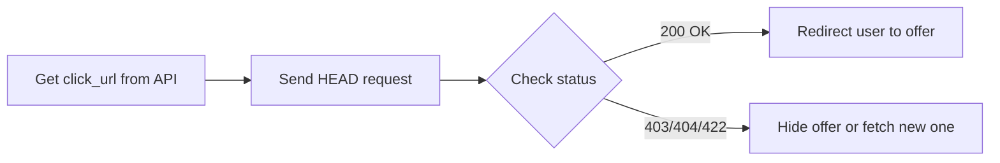

# Create an App Property in AdGem

Before AdGem can populate offers for your users, you need to create an App Property in the AdGem Dashboard. This page walks you through the setup process.

## Prerequisites

- An active [AdGem Publisher Account](https://dashboard.adgem.com/register)
- Basic information about your app (name, platform, category)

## Interactive setup guide

Follow along with our interactive demo to set up your App Property:

import CreateAppProperty from '@site/docs/_partials/sdk-step0-create-app.mdx';

<CreateAppProperty />

## Manual setup steps

If you prefer step-by-step written instructions:

### 1. Access the dashboard

1. Log in to the [AdGem Publisher Dashboard](https://dashboard.adgem.com/publisher/dashboard)
2. Navigate to **Properties & Apps** in the sidebar

### 2. Create a new property

1. Click **Add New Property**
2. Enter your app details:
   - **App Name** - The name of your application
   - **Platform** - iOS, Android, or Web
   - **Category** - The category that best describes your app
   - **Store URL** - Link to your app on the App Store or Google Play (if applicable)

### 3. Configure settings

After creating your property, you'll receive:
- **App ID** - Your unique AdGem application identifier
- **API Key** - Used for API authentication (keep this secure!)

### 4. Set up postbacks (optional)

Configure server postbacks to receive conversion notifications:
1. Navigate to your App Property settings
2. Scroll to **Postback Options**
3. Select **Server Postback**
4. Enter your postback URL

See our [Reward mechanism guide](/docs/integrate/reward-mechanism) for detailed instructions.

## What's next?

After setting up your App Property:

1. **Wait for approval** - Your app will be reviewed by our team
2. **Integrate the SDK** - Choose your [integration method](/docs/integrate/offer-delivery)
3. **Test in sandbox** - Verify your integration before going live
4. **Go live** - Start monetizing your users!

:::tip Need help?
Contact your dedicated Publisher Support Advocate if you have any questions about setting up your App Property or getting your app approved.
:::

## Readiness checklist: pre-flight checks

:::info Joining the beta
Pre-flight checks are currently in beta. To join the beta program, please contact your Publisher Support Advocate.
:::

AdGem has implemented a pre-flight check mechanism for offer links. This feature allows publishers to verify the status of an offer before redirecting users to the `click_url`, improving user experience by avoiding dead or irrelevant links.

### How it works

1. Retrieve the `click_url` from any of AdGem's APIs as usual
2. Before redirecting the user, send a `HEAD` request to this `click_url` from the user's device
3. Our system returns a status code indicating whether it's safe to redirect the user
4. Based on the status code, decide whether to show the offer or take alternative actions

:::note
AdGem only provides the status code. You can customize the message shown to users based on the response.
:::

### HTTP status codes

The pre-flight check returns one of the following status codes:

| Status Code | Meaning | Action |
|-------------|---------|--------|
| **200 OK** | Offer is active and user meets all targeting criteria | Safe to redirect the user |
| **403 Forbidden** | User doesn't meet targeting criteria, or user/publisher is banned | Don't show this offer |
| **404 Not Found** | Offer is not currently active or no longer exists | Remove offer from view |
| **422 Unprocessable Entity** | The request is invalid | Check your request parameters |

:::tip Store ID eligibility
A `store_id` eligibility check is performed automatically during the pre-flight check. However, we recommend implementing your own `store_id` filtering for more comprehensive control. You can collect the `store_id` via [Player Event Postbacks](/docs/integrate/reward-mechanism).
:::

### Implementation

#### Basic flow



#### Code example

```javascript
async function checkOfferAvailability(clickUrl) {
  try {
    const response = await fetch(clickUrl, {
      method: 'HEAD'
    });

    switch (response.status) {
      case 200:
        // Safe to redirect
        window.location.href = clickUrl;
        break;
      case 403:
        console.log('User not eligible for this offer');
        // Remove offer from view or fetch alternative
        break;
      case 404:
        console.log('Offer no longer available');
        // Remove offer from view
        break;
      case 422:
        console.log('Invalid request');
        // Check parameters
        break;
    }
  } catch (error) {
    console.error('Pre-flight check failed:', error);
  }
}
```

:::warning Important
The AdGem response to the `HEAD` request will **never** have a body, only a status code!
:::

### Examples

#### Successful scenario

```
Request: HEAD https://api.adgem.com/v1/click?appid=456&playerid=test035&platform=android&os_version=10.0.0&cid=4560

Response: HTTP 200 OK
Content: (none)
```

A `200` response means the offer is active and available. It's safe to redirect the player to the `click_url` to begin the offer.

#### Error scenarios

**Invalid Request (422)**
```
Request: HEAD https://api.adgem.com/v1/click?appid=example&playerid=test035&platform=android&os_version=10.0.0&cid=456

Response: HTTP 422 Unprocessable Entity
Content: (none)
```

The `appid` must be both an integer and a valid ID in the AdGem system.

**Offer Not Found (404)**
```
Request: HEAD https://api.adgem.com/v1/click?appid=456&playerid=test035&platform=android&os_version=10.0.0&cid=456

Response: HTTP 404 Not Found
Content: (none)
```

Even though `appid` and `cid` are valid, the offer is not currently active or no longer exists.

### Additional information

- The `store_id` eligibility check is only performed for `HEAD` requests and may not apply to all requests or all publishers
- Publishers are encouraged to maintain their own `store_id` filtering mechanisms for more comprehensive control over offer eligibility

### Resources

- [HEAD - HTTP | MDN](https://developer.mozilla.org/en-US/docs/Web/HTTP/Methods/HEAD) - External documentation on HEAD requests
