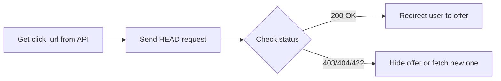

# Pre-flight Checks


:::info Joining the Beta
Pre-flight checks are currently in beta. To join the beta program, please contact your Publisher Support Advocate.
:::

## Overview

AdGem has implemented a pre-flight check mechanism for offer links. This feature allows publishers to verify the status of an offer before redirecting users to the `click_url`, improving user experience by avoiding dead or irrelevant links.

## How It Works

1. Retrieve the `click_url` from any of AdGem's APIs as usual
2. Before redirecting the user, send a `HEAD` request to this `click_url` from the user's device
3. Our system returns a status code indicating whether it's safe to redirect the user
4. Based on the status code, decide whether to show the offer or take alternative actions

:::note
AdGem only provides the status code. You can customize the message shown to users based on the response.
:::

## HTTP Status Codes

The pre-flight check returns one of the following status codes:

| Status Code | Meaning | Action |
|-------------|---------|--------|
| **200 OK** | Offer is active and user meets all targeting criteria | Safe to redirect the user |
| **403 Forbidden** | User doesn't meet targeting criteria, or user/publisher is banned | Don't show this offer |
| **404 Not Found** | Offer is not currently active or no longer exists | Remove offer from view |
| **422 Unprocessable Entity** | The request is invalid | Check your request parameters |

:::tip Store ID Eligibility
A `store_id` eligibility check is performed automatically during the pre-flight check. However, we recommend implementing your own `store_id` filtering for more comprehensive control. You can collect the `store_id` via [Player Event Postbacks](/docs/webhooks).
:::

## Implementation

### Basic Flow



### Code Example

```javascript
async function checkOfferAvailability(clickUrl) {
  try {
    const response = await fetch(clickUrl, {
      method: 'HEAD'
    });

    switch (response.status) {
      case 200:
        // Safe to redirect
        window.location.href = clickUrl;
        break;
      case 403:
        console.log('User not eligible for this offer');
        // Remove offer from view or fetch alternative
        break;
      case 404:
        console.log('Offer no longer available');
        // Remove offer from view
        break;
      case 422:
        console.log('Invalid request');
        // Check parameters
        break;
    }
  } catch (error) {
    console.error('Pre-flight check failed:', error);
  }
}
```

:::warning Important
The AdGem response to the `HEAD` request will **never** have a body, only a status code!
:::

## Examples

### Successful Scenario

```
Request: HEAD https://api.adgem.com/v1/click?appid=456&playerid=test035&platform=android&os_version=10.0.0&cid=4560

Response: HTTP 200 OK
Content: (none)
```

A `200` response means the offer is active and available. It's safe to redirect the player to the `click_url` to begin the offer.

### Error Scenarios

**Invalid Request (422)**
```
Request: HEAD https://api.adgem.com/v1/click?appid=example&playerid=test035&platform=android&os_version=10.0.0&cid=456

Response: HTTP 422 Unprocessable Entity
Content: (none)
```

The `appid` must be both an integer and a valid ID in the AdGem system.

**Offer Not Found (404)**
```
Request: HEAD https://api.adgem.com/v1/click?appid=456&playerid=test035&platform=android&os_version=10.0.0&cid=456

Response: HTTP 404 Not Found
Content: (none)
```

Even though `appid` and `cid` are valid, the offer is not currently active or no longer exists.

## Additional Information

- The `store_id` eligibility check is only performed for `HEAD` requests and may not apply to all requests or all publishers
- Publishers are encouraged to maintain their own `store_id` filtering mechanisms for more comprehensive control over offer eligibility

## Resources

- [HEAD - HTTP | MDN](https://developer.mozilla.org/en-US/docs/Web/HTTP/Methods/HEAD) - External documentation on HEAD requests
