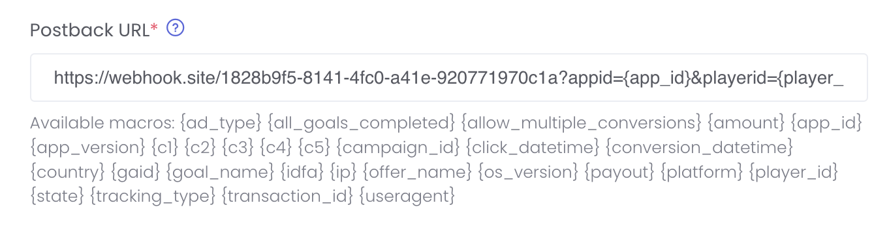

import PostbackMacrosTable from '@site/docs/_partials/postback-macros-table.mdx';
import SecurityCodeSamples from '@site/docs/_partials/security-code-samples.mdx';

# Server-to-Server Postbacks (v2)

Server-to-server postbacks deliver conversion events to your server using a GET request. By default, AdGem is set to send postbacks via GET request unless otherwise enabled by your Publisher Support Advocate.

:::tip[Note]
By default, AdGem only sends postbacks on Payable Conversion events. If you would like to enable Install postbacks to be sent to you, please reach out to your dedicated Publisher Support Advocate so we can enable this for you!
:::

## Postback Types

### Reward / Conversion Postbacks

By default, AdGem sends a postback for a rewarded player conversion event. AdGem sends this postback to the Postback URL set in the AdGem dashboard.

### Install Postbacks

For many of AdGem's offer campaigns we have the ability to send a postback to you when your players install an app from an offer. This allows you to better track the offer's performance with your players on your platform.

An install postback from AdGem follows the same Postback URL string schema as you have placed in the AdGem dashboard. For GET request postbacks, AdGem **automatically** appends `&nonpayable_install_goal=true` to the end of the string.

## Setting Up Your Postback

### Enabling Server Postback

From the AdGem Dashboard navigate to **Properties & Apps** and choose **Edit** from the **Options** drop down menu.

Once on the **Properties & Apps** menu, scroll down until you see **Postback Options**. Click on the radio input next to **Server Postback**.

Several new fields will appear that will allow you to configure your server postback.

### Postback Key

The first field is your **Postback Key**. Copy this key to a secure place as you will need it to implement Postback Hashing. **For security reasons, the Postback Key will only be visible once.** See the **[Securing Your Postbacks](#securing-your-postbacks)** section below to learn more about this important feature.

### Postback URL

Next, you will need to provide a **Postback URL** hosted on your server. AdGem will send a GET request to the URL you provide every time a conversion occurs from your traffic sources.

<PostbackMacrosTable />

<SecurityCodeSamples />
