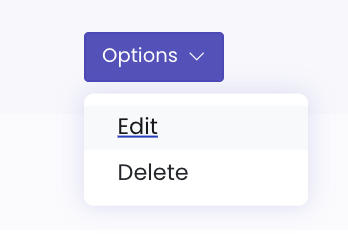
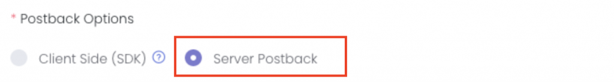
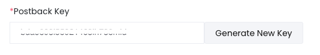
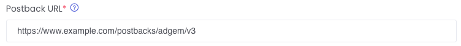

import SecurityCodeSamples from '@site/docs/_partials/security-code-samples.mdx';

# Server-to-Server Postbacks (v3)

`[Recommended]` Server-to-server postbacks deliver conversion events to your server using a POST request with a signed, structured JSON body. This is the production-grade reward path nearly every publisher uses.

AdGem can send postbacks for **reward** events and **install** events.

#### Reward Postbacks

These postbacks correspond to a player converting on a rewarded goal. Most offer goals are of this type. The `conversion_type` field will indicate this with a value of `"reward"`.

#### Install Postbacks

:::tip[Note]
By default, AdGem only sends postbacks on Payable Conversion events. If you would like to enable Install postbacks to be sent to you, please reach out to your dedicated Publisher Support Advocate so we can enable this for you!
:::

These postbacks correspond to a player completing an install goal. Install goals are used primarily for tracking purposes, and they do not reward the player with in-game currency. The `conversion_type` field will indicate this with a value of `"install"`.

## Setting Up Your Postback

### Enabling Server Postback

From the AdGem Dashboard navigate to **Properties & Apps** and choose **Edit** from the **Options** drop down menu.



Once on the **Properties & Apps** menu, scroll down until you see **Postback Options**. Click on the radio input next to **Server Postback**.



Several new fields will appear that will allow you to configure your server postback.

### Postback Key

The first field is your **Postback Key**. Copy this key to a secure place as you will need it to verify postback signatures. **For security reasons, the Postback Key will only be visible once.** See the **[Securing Your Postbacks](#securing-your-postbacks)** section below to learn more about this important feature.



### Postback URL

Next, you will need to provide a **Postback URL** hosted on your server. A POST request will be made to the postback URL defined in your AdGem publisher dashboard every time a conversion occurs from your traffic sources.



## Receiving AdGem Postbacks

Here is an example of the request body:

```json
{
    "request_id": "01786456-b959-404a-baa7-05ef8a2e0290",
    "timestamp": 1720727170,
    "data": {
        "app_id": "2",
        "campaign_id": "1",
        "player_id": "bernhard.edison",
        "amount": 150,
        "payout": 1.5,
        "all_goals_completed": 1,
        "conversion_id": "c5eb2a9d-41a4-4088-80bb-ebc87bd1bb62",
        "app_version": "1.0",
        "ad_type": "offerwall",
        "country": "US",
        "c1": "custom value 1",
        "c2": "custom value 2",
        "c3": "custom value 3",
        "c4": "custom value 4",
        "c5": "custom value 5",
        "gaid": "bk9384xs-p449-96ds-r132",
        "idfa": "AB1234CD-E123-12FG-J123",
        "ip": "24.24.24.25",
        "os_version": "10.0.0",
        "platform": "Other",
        "state": "New York",
        "click_datetime": "2024-07-15 10:39:55",
        "conversion_datetime": "2024-07-15 10:39:55",
        "goal_name": "Reach level 20",
        "goal_id": "12345678911123456",
        "offer_name": "Romaguera-Harber",
        "tracking_type": "CPA",
        "allow_multiple_conversions": false,
        "store_id": "com.whatever.example",
        "offer_id": "12345678900123456",
        "conversion_type": "reward"
    }
}
```

### Request Body Fields

| Field | Description |
|-------|-------------|
| request_id | A unique ID for this postback request |
| timestamp | Unix timestamp (seconds since epoch) of when the postback was sent |
| app_id | The unique ID for your app on AdGem |
| campaign_id | The unique ID of the campaign/offer that was completed |
| player_id | The unique ID of the player/user on your system |
| amount | The amount of virtual currency to reward the user who completed the offer |
| payout | The decimal amount of revenue earned from the user completing the offer |
| all_goals_completed | Indicates if all goals have been completed for the campaign |
| conversion_id | The unique AdGem ID of the offer conversion |
| app_version | The version of your app where the click originated |
| ad_type | The type of ad unit where the click originated (for example `offerwall`) |
| country | The location (i.e., the ISO country code) of the user when the offer was completed |
| c1 | A custom parameter value as set by the publisher |
| c2 | A custom parameter value as set by the publisher |
| c3 | A custom parameter value as set by the publisher |
| c4 | A custom parameter value as set by the publisher |
| c5 | A custom parameter value as set by the publisher |
| gaid | Google advertising ID, available when the developer is using Google Play services |
| idfa | Apple advertising ID, available when the user has not limited ad tracking |
| ip | The IP address for the user who completed the offer |
| os_version | The user's operating system version number |
| platform | The platform this user's device is using (for example, `iOS`) |
| state | The user's state or region where they are located |
| click_datetime | The exact date and time when the user clicked on the offer |
| conversion_datetime | The exact date and time when the user completed the offer |
| goal_name | Indicates the name of the completed goal |
| goal_id | Indicates the unique ID of each goal in a campaign/offer that was completed |
| offer_name | The name of the campaign/offer that was completed as it shows in the Offerwall/API call |
| tracking_type | The type of offer/campaign completed (for example, `CPI`, `CPE`, `CPA`, `CPC`, `Market Research`) |
| allow_multiple_conversions | Boolean indicating if an offer allows for multiple conversions |
| store_id | The unique ID of the app campaign, as assigned by the Google Play Store or Apple App Store |
| offer_id | The unique offer version with which the user engaged |
| conversion_type | The type of the conversion (for example, "install" when the `amount` is 0, otherwise "reward") |

<SecurityCodeSamples />
